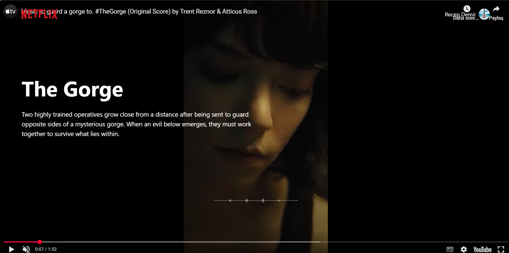

# Netflix App
[Live Demo](https://netlix-app-e77933.netlify.app/)
## Screenshots


 
 


## Overview
Netflix App is a Next.js-based web application that provides a seamless streaming experience for movies and TV shows. It features Firebase authentication, a dynamic user interface, and a modern tech stack.

## Features
- User authentication with Firebase (Email/Password & Google Sign-In)
- Dynamic routing with Next.js
- Tailwind CSS for styling
- Toast notifications using `react-toastify`

## Installation

1. Clone the repository:
   ```sh
   git clone https://github.com/yourusername/netflix-app.git
   ```
2. Navigate to the project directory:
   ```sh
   cd netflix-app
   ```
3. Install dependencies:
   ```sh
   npm install
   ```

## Usage

### Development Mode
To start the development server:
```sh
npm run dev
```

### Build for Production
To create an optimized production build:
```sh
npm run build
```
To start the production server:
```sh
npm run start
```

## Configuration
1. Create a `.env.local` file in the root directory and add your Firebase credentials:
   ```env
   NEXT_PUBLIC_FIREBASE_API_KEY=your_api_key
   NEXT_PUBLIC_FIREBASE_AUTH_DOMAIN=your_auth_domain
   NEXT_PUBLIC_FIREBASE_PROJECT_ID=your_project_id
   ```
2. Enable authentication providers in your Firebase console (Email/Password & Google Sign-In).
3. Add your deployment domain to Firebase authentication settings if hosting publicly.

## Technologies Used
- **Next.js** (14.2.16) - React framework for server-side rendering and static site generation
- **React** (18.2.0) - UI library
- **Firebase** (10.12.2) - Authentication and backend services
- **Tailwind CSS** (3.4.1) - Utility-first CSS framework
- **React Toastify** (10.0.5) - Notifications

## License
This project is licensed under the MIT License.

## Author
[Your Name] - [Your GitHub Profile]

